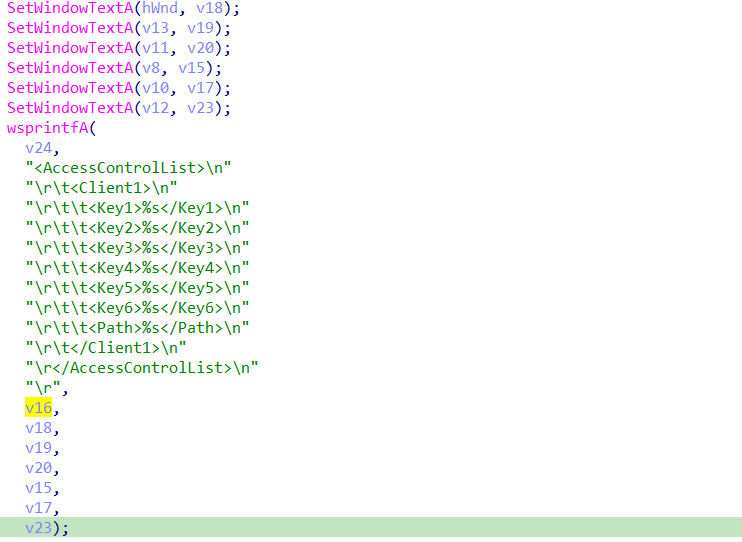
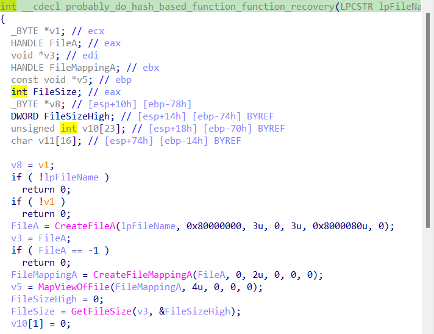
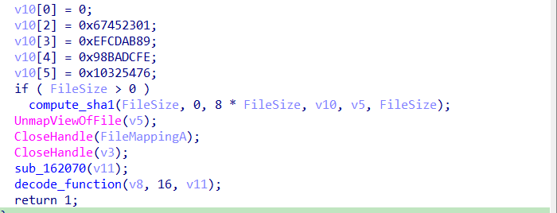

# SkypeACLKeyGen.exe analysis for hacking team

So...

<figure><figcaption></figcaption></figure>

what do we analyse today ? well today we analyse a piece of software from hacking team. It's about skype?  why do we do this ? idk i find it interesting.&#x20;

So anyway we start by inspecting runtime behaviour. As you can see it requires a username and a plugin path and it outputs an acl ? sooo whatt is thissszz about ? Well inspecting this [https://airbus-seclab.github.io/skype/vskype-part2.pdf](https://airbus-seclab.github.io/skype/vskype-part2.pdf) , tells us that - "Skype implements an ACL-like system to allow or disallow plugins to attach themselves to a runnning instance A plugin ”signature” is added to the configuration file based on the user reply to a warning dialog" - . So ok what's in the folder of that software ?&#x20;

<figure><figcaption></figcaption></figure>

So amm ok... still dont tells us anything . right so we see a stage 1 shellcode with office ending on that folder which may indicate an office exploit(still not yet confidirmed) fakeport which is a c# app tracer.exe and other stuff. Cool my hunch is that the actuall plugin will be register is tracer.exe . why is that ? Well from same pdf - "Skype voice engine can generate encrypted trace files if Logging and Logging2 are set Encryption is much simpler, a basic XOR with a 31 byte key" - . So let's give an analysis of the actuall generator of the acl , and next let's go over tracer, and maybe in other post over shellcode ;)&#x20;

We start  with this

<figure><figcaption></figcaption></figure>

Than move to this&#x20;

<figure><figcaption></figcaption></figure>

And finally flow into these

<figure><figcaption></figcaption></figure>

 

<figure><figcaption></figcaption></figure>

 

<figure><figcaption></figcaption></figure>

From there flow into this

.png>)&#x20;

<figure><figcaption></figcaption></figure>

<figure><figcaption></figcaption></figure>

.png>)&#x20;

<figure><figcaption></figcaption></figure>

<figure><figcaption></figcaption></figure>

Cool another dynamic easteregg behaviour is this when you input user and plugin to be run you get .png>)

Anyway so we go further and analyse&#x20;

<figure><figcaption></figcaption></figure>

<figure><figcaption></figcaption></figure>

<figure><figcaption></figcaption></figure>

So from a topdown view it compute sha2 of content of file and it also maps it's contents in memory. Unfortunatelly for me dynamically it failed and so it didn't do anything :/\ what can we do . We move further.  We go in probably\_do\_hash\_based\_function\_function\_recovery.

<figure><figcaption></figcaption></figure>

<figure><figcaption></figcaption></figure>

Unf it's the same case as previous case where we fail to map it in memory and exit from the function. non of the less we only compute md5 and probably do some function retrival based on md5  comparison.

We than go ahead and do some malloc and memset

.png>)

We than convert the filename to uppercase

<figure><figcaption></figcaption></figure>

Same thing for username

<figure><figcaption></figcaption></figure>

Cool and next we do this:

<figure><figcaption></figcaption></figure>

 

<figure><figcaption></figcaption></figure>

Basically create out own acl to allow us to run our plugin. In this case, now i assume it will be Tracer.exe which theoretically i suppose will log trace files generated by Skype voice engine.

<figure><figcaption></figcaption></figure>

<figure><figcaption></figcaption></figure>

<figure><figcaption>
Output Result of mentioned upper images function
</figcaption></figure>

<figure><figcaption>
Output Result of mentioned upper images function
</figcaption></figure>

That's about it for now. Later today i will come back and update this . For now what's left is to analyse this half on function only

<figure><figcaption></figcaption></figure>

 

<figure><figcaption></figcaption></figure>

Also later when i will be back we'll dive in some\_decode function just for fun and from there we'll go into tracer.exe binary. Happy hacking and see ya soon.
